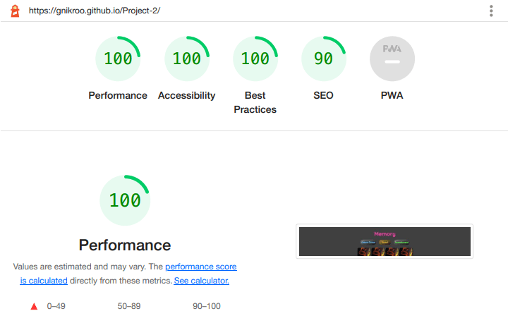

Readme 

# Memory 

Memory is a classic game played by attempting to remember where objects are when hidden in order to find their pairs. I wanted to create a project that was fun and eye catching while practicing my newfound JavaScript skills. 

The live website can be found on [GitHub Pages](https://gnikroo.github.io/Project-2/)

To open links in a new browser tab, press CTRL + Click. 

## Table of Contents
* [User Experience Design (UX)](#ux)

  * [Strategy](#strategy)
  
    * [Site Functionality](#site-functionality)

  * [Scope](#scope)

    * [Features](#features) 

  * [Structure](#structure)

  * [Skeleton](#skeleton)

  * [Surface](#surface)

    * [Visual](#visual)

    * [Buttons](#buttons)

    * [Gameplay](#gameplay)

    * [Game End](#game-end)
    
* [Testing Strategy](#testing-strategy) 

  * [Validator Testing](#validator-testing) 

  * [Bugs](#bugs) 

* [Deployment](#deployment) 

* [Credits](#credits) 

* [Media](#media) 

  * [Content](#content) 

  * [Acknowledgements](#acknowledgements) 

## UX

### Strategy
* As a casual gamer, I want to play a simple game to pass the time
* As a serious gamer, I want to control the level of challenge
* As a busy professional and parent, I don't want to scroll for links necessary to enjoy the game
* As someone who is concerned over use of my personal data, I want to be able to have control over what is stored
* As someone with impaired vision, I want to be able to use a screen reader to help me play the game

#### Site Functionality
The goal of the site is to provide an easy to navigate game with an engaging design. Users have control over the level of challange (playing aginst the clock, playing against their past records, simply playing to win) as well as what happens to their information. A user can choose to store their score or not to. A user can also choose to clear their local storage at any time right from the Game Rules page. The site is written in semantic HTML allowing users to easily navigate using a screen reader. 

### Scope
#### Features 
* Responsive Design across the range of devices available. 
* Links and buttons are easy to find and utilize. 
* Users can challenge themselves by playing against the clock or beating previous records.
* The site is fully accessible. 

### Structure
User Stories: Acceptance Criteria: Implementation
> As a casual gamer, I want to play a simple game to pass the time
* Acceptance Criteria: 
  * The game board should have a recognizable layout with quick access to game rules and game buttons.
* Implementation:
  * The layout follows standard memory game layout, mimics the look of a card deck, and provides immediate access to the game. The design is inviting and fun. The navigation bar has links to the game rules and the scoreboard. Each of these references the name of the game with a clear and playful design throughout.
> As a serious gamer, I want to control the level of challenge
* Acceptance Criteria:
  * The game should offer the option to adjust for difficulty.
* Implementation:
  * By starting the game, a stopwatch autmatically begins to track the time passed. After winning, the user can choose to add their name and corresponding time to the scoreboard. This allows the user to challenge themselves at three different levels: Easy - play to win. Medium - play against the clock by choosing how quickly the user should finish the game. Hard - play to beat the current record on the scoreboard.
> As a busy professional and parent, I don't want to scroll for links necessary to enjoy the game
* Acceptance Criteria:
  * All navigation should be easily accessible, noticeable, and clearly written so the purpose is immediately understood.
* Implementation:
  * The links are color-coded with content describing their destination. The game board shrinks to fit the size of the screen so that important links/buttons are in the viewport. Buttons required for gameplay are colorfully designed with simple content reflecting their exact purpose.
> As someone who is concerned over use of my personal data, I want to be able to have control over what is stored
* Acceptance Criteria:
  * A user should be able to choose what and when their information is stored.
* Implementation:
  * After winning the game, the user is prompted by the modal to put in their name which the user can ignore by clicking outside of the pop-up. If they choose to store their score, they can clear the local storage at any time by pressing the clear scoreboard button located in Game Rules. By placing the button on a seperate page, the risk for the user to accidentally press the button when reviewing the scores is lessened.
> As a someone with impaired vision, I want to be able to use a screen reader to help me play the game
* Acceptance Criteria:
  * The document should be written in semantic HTML.
* Implementation:
  * The document is written in semantic HTML which is verified by lighthouse and passing the site through the W3C Validator service.

### Skeleton
#### Homepage

#### Game Rules 

#### Scoreboard (formerly High Scores) 

### Surface
The game was designed to provide a fun, time wasting game that is pleasing to the eye. It is simple and yet provides the opportunity for challenge when desired. The buttons and links are designed to be eye catching so that the user can easily find what is needed yet blends seamlessly with the overall design so as not to distract from the game. You can find the game rules and scoreboard at the top of the screen. By following either, you can easily navigate to any other page you’d like. The design is smooth with buttons and input fields rounded to complement the 1990’s, neon aesthetic of the cards and font colors. 

#### VISUAL
The size of cards is adjusted according to user’s total screen width. This allows for comfortable playing without the need to scroll during gameplay.
*  

#### BUTTONS
The buttons are given styles during hover and when active so that the user is aware of when an irreversable action is about to be committed.

#### GAMEPLAY
The user begins the game by clicking the Start! button. The button then becomes the timer to track the time passed before winning the game. The user clicks on any card to flip it over. If a match is found, they remain flipped. If it is not found, they remain visible for one second before flipping back over.

#### GAME END
Once all cards are flipped over, the user has won. A modal appears after winning the game to inform the user how long it took to win and prompts them to log the score to the scoreboard with a name. The time can be logged to the scoreboard or the user can opt to click outside of the modal to get back to the winning game. If the user presses the reset button, the timer will reset and the cards will reshuffle.

## Testing Strategy 
 
* The game works in different browsers: Chrome, Firefox, Safari.

* It is responsive, has a cohesive look, and functions across standard screen sizes as confirmed by using the devtools device toolbar.

* The navigation (including buttons and links), logo, game rules, and scoreboard are understandable and adhere to the neon theme.

* I have confirmed that the form works, requires a name entry to submit (by pressing Enter or clicking the Submit button), and will exit without storing data if the user clicks outside of the modal.

* The modal appears when the game is won as expected and disappears after acheiving its function.
 
### Validator Testing 
* HTML - W3C Validator
  * No errors were found. [Report](https://validator.w3.org/nu/?doc=https%3A%2F%2Fgnikroo.github.io%2FProject-2%2F) 
* CSS - W3C CSS Validation Service - Jigsaw
  * No errors were found. [Report](https://jigsaw.w3.org/css-validator/validator?uri=https%3A%2F%2Fgnikroo.github.io%2FProject-2%2F&profile=css3svg&usermedium=all&warning=1&vextwarning=&lang=en) 
* JavaScript - JSHint.com
  * No errors were found for all .js files. 
    * [Script Report](assets/images/script-js.jpg)
    * [Scoreboard Report](assets/images/score-js.jpg) 
    * [Game Rules Report](assets/images/rule-js.png)
* Lighthouse
  * Mobile: 93, 100, 100, 92
    *  
  * Desktop: 100, 100, 100, 90
    * 

### Bugs 
One bug was found after deployment. The reset game button allowed the user to flip the cards even though the start game button hadn't been clicked. This was easily remedied by changing some of the names within the functions. 

## Deployment 
My site was deployed to [GitHub Pages](https://gnikroo.github.io/Project-2/). In settings for my Memory game project repository, I selected the main branch in the source section. The link was then generated publishing the website.  
* From the GitHub repository, select settings   
* Click the pages link from the left-hand menu  
* In the source section drop-down menu, choose main branch   
* The page will then refresh with indicating successful deployment.    

## Credits 
### Media
* All images were downloaded and used with permission from [Pexels](https://www.pexels.com/).
* Favicon was created and downloaded with permission from [freefavicon](https://freefavicon.com/).  
 
### Content  

* The function for formatting time (formatTime) was inspired by the answer supplied by user powtac on [stackoverflow](https://stackoverflow.com/a/6313008). 

* My original card grid was created with the support of [CSS Tricks’](https://css-tricks.com/dont-overthink-flexbox-grids/) article on flexbox grids. This was later modified to allow for responsive card width.

* The gameModal object was inspired by [W3School's](https://www.w3schools.com/howto/tryit.asp?filename=tryhow_css_modal) example on modals. 

* The button pseudo effects are a modified version of Evans Pauliuts button design found on [CodePen](https://codepen.io/evanscode/pen/KqWRyg).

### Acknowledgements  
 
* I would like to once more thank my husband, Nima Nikroo. JavaScript was nearly impossible to understand until he helped guide me through the steps needed to create the logical functions behind what makes this game work. 